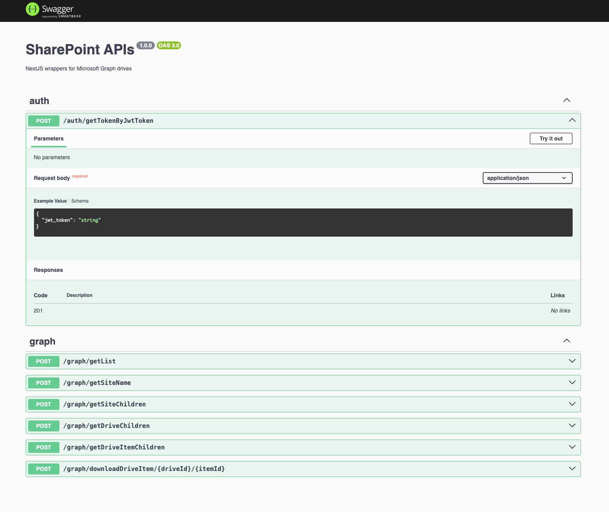

# SharePoint-APIs (NestJS + Microsoft Graph)

Minimal NestJS API to exchange a certificate-signed client assertion (JWT) for an access token and call Microsoft Graph `v1.0` endpoints (drives, sites, items).

## Prerequisites
- Node.js 18+
- OpenSSL (for signing)
- curl, jq (optional for parsing JSON)

## Quick start
1) Install dependencies and run the API
```
npm install
npm run build && npm start
```
- API: `http://localhost:3000`
- Swagger: `http://localhost:3000/docs`

2) Prepare `.env` (mock placeholders – replace with your values later)
```
SHAREPOINT_TENANT_ID=00000000-0000-0000-0000-000000000000
SHAREPOINT_CLIENT_ID=11111111-1111-1111-1111-111111111111
PORT=3000
```
Note: do not commit real secrets or keys.

---

## Generate the client assertion (JWT) via bash
This project includes `generate-jwt.sh` which signs an RS256 JWT using your private key and certificate thumbprint.

What you need to prepare and replace (mock examples shown):
- Private key path in PEM format: `KEY_PATH="my-app.key"`
- Tenant ID (GUID): `00000000-0000-0000-0000-000000000000`
- Client ID (Application ID): `11111111-1111-1111-1111-111111111111`
- Certificate thumbprint (hex): `AAAAAAAAAAAAAAAAAAAAAAAAAAAAAAAAAAAAAAAA` (40 hex chars)

Open `generate-jwt.sh` and replace the placeholders accordingly. The script already sets a 1-year expiry, which Azure AD requires for client assertions.

Run to generate the assertion:
```
ASSERTION=$(./generate-jwt.sh)
echo "$ASSERTION" | head -c 40 && echo '...'
```

Important note about x5t (thumbprint) used in the JWT header:

> Note that the certificate thumbprint <base64-encoded-certificate-thumbprint> usually comes in a hexadecimal representatation, e.g. 49AF595AE9C628BCAF5AB9D36B4EEC97DFF24458
>
> Sites like Base64.guru or this CyberChef recipe can be used to get the correct base 64 encoded representation of the certificate thumbprint: Sa9ZWunGKLylvWrnTa07s19/yRFg=

You can convert your hex thumbprint to base64url (x5t) automatically by the script, but the above is a helpful reference.

---

## Exchange the client assertion for an access token
Endpoint: `POST /auth/getTokenByJwtToken`
- Body (JSON):
```
{ "jwt_token": "<ASSERTION_FROM_SCRIPT>" }
```
- Example:
```
ASSERTION=$(./generate-jwt.sh)
curl -sS -X POST http://localhost:3000/auth/getTokenByJwtToken \
  -H 'Content-Type: application/json' \
  -d "{\"jwt_token\": \"$ASSERTION\"}"
```
Response contains `access_token` that you can use with Microsoft Graph and the graph endpoints below.

---

## Use the access token with Graph endpoints
All Graph routes expect body `{ "access_token": "..." }` and will proxy requests to Microsoft Graph.

- Get site by name
```
POST /graph/getSiteName?siteName=MySite
Body: { "access_token": "<ACCESS_TOKEN>" }
```
Graph it calls: `https://graph.microsoft.com/v1.0/sites/root:/sites/MySite`

- Get drives under a site (optionally filter by drive name)
```
POST /graph/getSiteChildren?siteId=<SITE_ID>&driveName=Documents
Body: { "access_token": "<ACCESS_TOKEN>" }
```
Graph it calls: `https://graph.microsoft.com/v1.0/sites/<SITE_ID>/drives?$select=id,name&$filter=name eq 'Documents'`

- Get children of drive root (optionally filter by item name)
```
POST /graph/getDriveChildren?driveId=<DRIVE_ID>&itemName=MyFolder
Body: { "access_token": "<ACCESS_TOKEN>" }
```
Graph it calls: `https://graph.microsoft.com/v1.0/drives/<DRIVE_ID>/root/children?$select=id,name&$filter=name eq 'MyFolder'`

- Get children of a specific drive item (folder)
```
POST /graph/getDriveItemChildren?driveId=<DRIVE_ID>&itemId=<ITEM_ID>&filter=name eq 'MyFile.ext'
Body: { "access_token": "<ACCESS_TOKEN>" }
```
Graph it calls: `https://graph.microsoft.com/v1.0/drives/<DRIVE_ID>/items/<ITEM_ID>/children?$select=id,name,file,folder&$top=1000&$filter=...`

- Download a file content
```
POST /graph/downloadDriveItem/<DRIVE_ID>/<ITEM_ID>
Body: { "access_token": "<ACCESS_TOKEN>" }
```
Graph it calls: `https://graph.microsoft.com/v1.0/drives/<DRIVE_ID>/items/<ITEM_ID>/content`

---

## Swagger examples
Open `http://localhost:3000/docs` and:
- Use `POST /auth/getTokenByJwtToken` with `jwt_token` you generated to obtain an `access_token`.
- Paste that `access_token` into other `graph` routes’ example bodies.
- Try `getSiteName`, `getSiteChildren`, `getDriveChildren`, `getDriveItemChildren`, and `downloadDriveItem` directly from Swagger.



---

## Security notes
- Keep your private key (.key/.pem) outside of version control.
- Do not commit real tenant/client IDs or tokens.
- Ensure your app registration has the required Microsoft Graph application permissions (e.g., Sites.Read.All / Files.Read.All) and admin consent.
